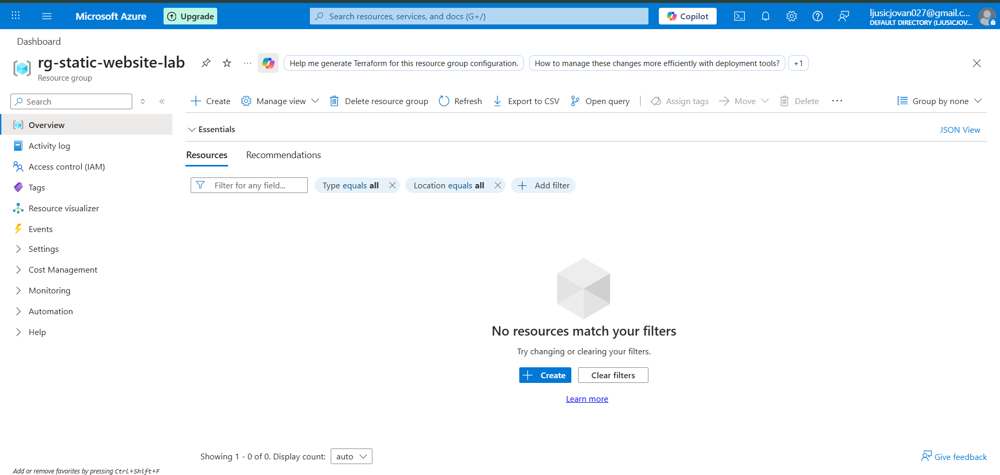
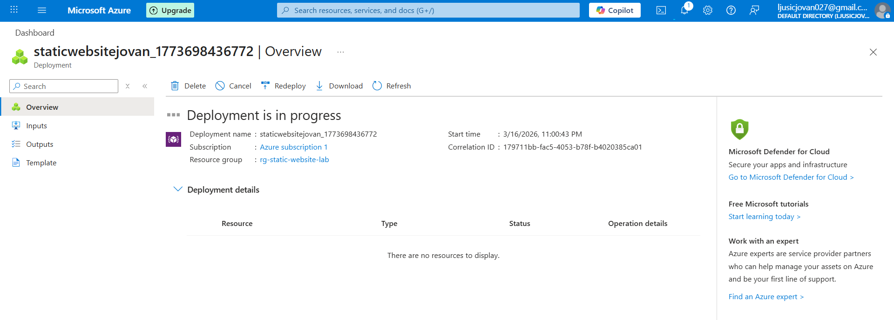
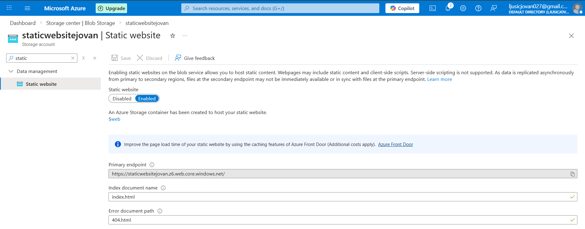
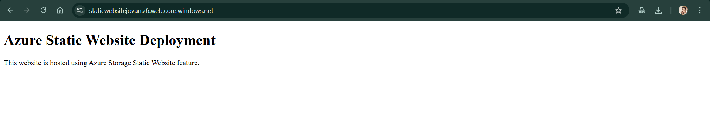

# Azure Static Website Lab

## Overview

This project demonstrates how to deploy and host a **static website using Azure Storage Static Website feature**.

The website is deployed through an **Azure Storage Account** and exposed via a public endpoint generated by Azure.

This lab illustrates a simple and cost-efficient way to host static content directly from Azure cloud infrastructure.

---

## Azure Services Used

* Azure Resource Group
* Azure Storage Account
* Azure Blob Storage
* Azure Static Website Hosting

---

## Architecture

The static website is hosted inside Azure Storage using the **$web container**.

```
User
 |
Internet
 |
Azure Storage Account
 |
Static Website ($web container)
 |
index.html
```

---

## Deployment Steps

1. Create a **Resource Group**

```
rg-static-website-lab
```

2. Create a **Storage Account**

```
staticwebsitejovan
```

3. Enable **Static Website Hosting**

```
Settings → Static website → Enable
```

Configuration:

```
Index document: index.html
Error document: 404.html
```

4. Upload website files to the **$web container**

```
index.html
```

5. Access the website via the **Primary Endpoint**

Example:

```
https://staticwebsitejovan.z6.web.core.windows.net
```

---

## Website Example

The deployed page displays a simple static HTML page hosted entirely through Azure Storage.

---

## Screenshots

### Resource Group Created



### Storage Account Created



### Static Website Enabled



### Web Container


### Website Running



---

## Cleanup

To avoid unnecessary costs, delete the resource group after completing the lab.

```
Resource Group → Delete → rg-static-website-lab
```

This will remove all deployed resources.

---

## Learning Outcomes

Through this project the following concepts were practiced:

* Azure Storage fundamentals
* Static website hosting using Azure Blob Storage
* Cloud resource organization with Resource Groups
* Deploying and exposing web content through Azure infrastructure


